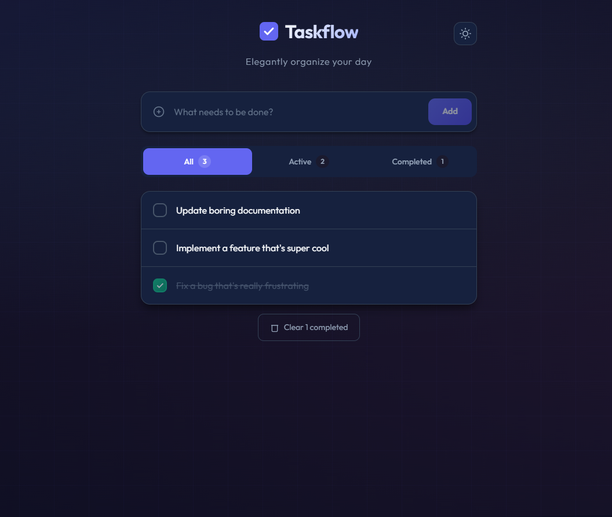
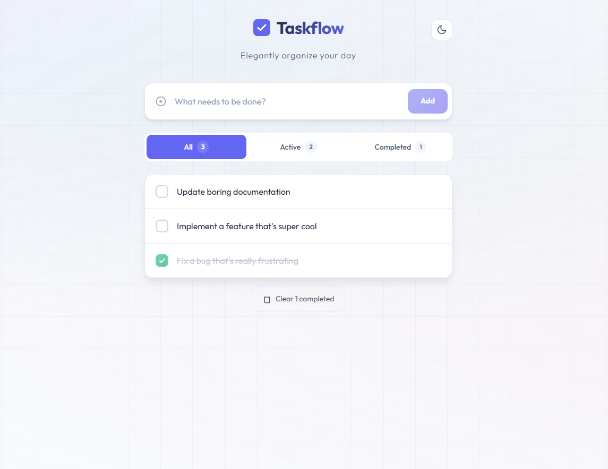

# Todo App

A modern, feature-rich Todo application built with **Angular 21** and **Angular Signals** for reactive state management.


## Screenshots

### Dark Mode



### Light Mode



## ✨ Features

- **Add Todos** - Quickly add new tasks with a simple input
- **Edit Todos** - Double-click to edit existing tasks inline
- **Delete Todos** - Remove tasks you no longer need
- **Toggle Completion** - Mark tasks as complete/incomplete
- **Filter Todos** - View all, active, or completed tasks
- **Clear Completed** - Bulk remove all completed tasks
- **Dark/Light Theme** - Toggle between themes with system preference detection
- **Persistent Theme** - Theme preference saved to localStorage

## 🛠️ Tech Stack

- **Framework**: Angular 21 with standalone components
- **State Management**: Angular Signals (reactive primitives)
- **Styling**: Tailwind CSS 4
- **Forms**: Angular FormsModule (two-way binding)
- **Testing**: Vitest with jsdom

## 🚀 Getting Started

### Prerequisites

- Node.js (v18 or higher recommended)
- npm (v10 or higher)

### Installation

```bash
# Clone the repository
git clone <repository-url>
cd todo-app

# Install dependencies
npm install
```

### Development Server

```bash
npm start
```

Navigate to `http://localhost:4200/`. The application will automatically reload when you modify source files.

### Build

```bash
npm run build
```

Build artifacts will be stored in the `dist/` directory.

### Testing

```bash
npm test
```

Runs unit tests using Vitest.

## 📁 Project Structure

```
src/
├── app/
│   ├── app.ts          # Main component with todo logic
│   ├── app.html        # Component template
│   ├── app.css         # Component styles
│   ├── app.spec.ts     # Unit tests
│   ├── app.config.ts   # App configuration
│   └── app.routes.ts   # Routing configuration
├── index.html          # Main HTML file
├── main.ts             # Application bootstrap
└── styles.css          # Global styles
```

## 📖 Usage

1. **Add a todo**: Type in the input field and press Enter or click the add button
2. **Complete a todo**: Click the checkbox next to a task
3. **Edit a todo**: Double-click on a task's text to edit it
4. **Delete a todo**: Click the delete (×) button on a task
5. **Filter tasks**: Use the "All", "Active", or "Completed" buttons
6. **Clear completed**: Click "Clear completed" to remove all finished tasks
7. **Toggle theme**: Click the theme button to switch between dark and light modes

## 🎨 Theming

The app supports both dark and light modes:
- Automatically detects system color scheme preference
- Manually toggle via the theme button
- Preference is persisted in localStorage

## 📄 License

This project is private and not licensed for public distribution.
